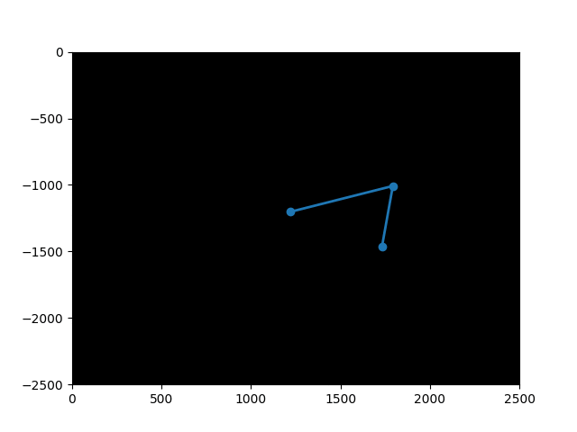

# Physics-Assisted Double Pendulum Neural Network
A multi-layer perceptron predicting the position of a double pendulum

## Abstract
A double pendulum is a simple physical system consisting of a pendulum with another pendulum attached to its un-fixed end. However, this simple system can result in chaotic movement that is difficult and computationally expensive to predict. I propose using a physics assistant neural network to predict the movement of a chaotic double pendulum. 

A MPL neural network will be trained on a dataset of observed positions of a double pendulum under chaotic motion along with a mathematical model that predicts the motion of the pendulum as well. Properties such as the length, mass, and positions of each rod will be perceived the network as inputs to generate the predicted position of both pendulums on the next time step.

Backpropagation networks have been frequently discussed within the course over the previous few weeks, and I believe applying the basic practices demonstrated through the course to the double pendulum will be very fitting. The double pendulum provides a simple model that can be visualized easily, but provides a complex and rich movement that should hopefully show that the neural network is able to strongly approximate the movement of a real life pendulum.

## Data Set
The network will be trained using a IBM's "Double Pendulum Chaotic" dataset that features position data measured from various real-life recordings of a double pendulum. You can see a gif from one of these recordings below:

> The movement slowed down greatly when converting this gif.

While the data set is generated from a series of videos, the network will be trained using a collection of CSV files containing x and y position data for the pendulum. In addition to this real-life data set, I'll also be using a physics-based model to predict the pendulum. The physics based model will be derived and calculated beforehand for each test data set. This data set will be used to add an additional term to the loss function: the physics-based error.

The network will be trained to minimize the total error between the actual dataset and the error with physics based model.

## Plotting
To visualize the csv data, the `make_plot.py` file can be used to generate an animated plot showing the movement of the pendulum. This will be useful for comparing the movement of the actual double pendulum, the physics-based model, and the network's model. An example of the visualization can be seen below:

> While plotting, it's become apparent that the data needed to be rotated 90 degrees to match the original footage

# Deriving the Physics-guided model

We're looking to derive a way to represent the pendulum in a way that will fit more simply