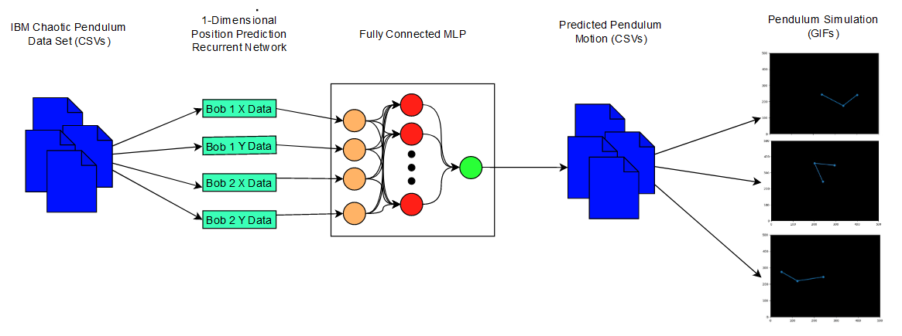

<center>

# Predicting Chaotic Double Pendulum 


</center>

<center>

## Jacob Ryan

</center>

<center>

### 12/18/2020

</center>
<div style="page-break-after: always;"></div>

## Abstract

A double pendulum is a simple physical system consisting of a pendulum with another pendulum attached to its un-fixed end. However, this simple system can result in chaotic movement that is difficult and computationally expensive to predict. I propose using a physics assistant neural network to predict the movement of a chaotic double pendulum. 

A multi-layer perceptron (MLP) neural network will be trained on a dataset of observed positions of a double pendulum under chaotic motion along with a mathematical model that predicts the motion of the pendulum as well. The network will perceive the x and y coordinate positions of both of the pendulum's bobs for each time step. The MLP shall be fully connected and should observe the position input from a set of 4 recurrent neural networks that predict the position of each bob. 

Backpropagation networks have been shown to been able to model functions (I.E. sin waves) much more accurately that previous neural network designs. Applying this type of training to a prediction over time problem proved challenging. The double pendulum provides a simple model that can be visualized easily, but provides a complex and rich movement that proved too challenging for the RNN to accurately predict the motion of bobs over time steps. While prediction of more consistent movement patterns such as a sin wave were possible, the same techniques were not able to predict the movement of a pendulum's bob.

## Outline

Backpropagation over MLPs has been shown to be able to model functions with consistent movement such as sinusoidal waves. However, the mapping of these functions does not reflect the temporal nature. In order to aid the MLP in returning an accurate position for the position of both pendulum bobs, two recurrent networks could be used for each bob (a total of 4) to predict the upcoming position of the bob. The output of the RNNs will not take into account the position of their paired X or Y value nor the coordinate position of the other bobs. Ideally, the output from the four RNNs will serve as effective estimates that can be directly passed into the MLP once all the models are trained.

To implement this design, the network is passed a dataset generated from a physics-based model describing the motion of a simulated pendulum for 60 seconds. Once the network has been sufficiently trained on the artificial model, it can be passed the real-life data at a lower learning rate. Real-life data proves to be more chaotic than the output from the physics generated model, and a lower learning rate will prevent outliers in real-life movement from damaging the models ability to predict. 



The design is implemented using the following tools and hardware:

>   ### Software:
>   -   Python 3.7.0
>   -   Jupyter Notebooks 4.6.3
>   -   Numpy 1.19.4 
>   -   Matplotlib 3.3.3
>   -   IBM Double Pendulum Chaotic Dataset
>   
>   ### Hardware:
>   -   Dell XPS 15 9570
>   -   Microsoft Windows Pro
>   -   Intel i7-8760H
>   -   16.0 GB RAM

## Data Set
The network will be trained using a IBM's "Double Pendulum Chaotic" dataset that features position data measured from various real-life recordings of a double pendulum. A frame from one of these recordings is included below:


> Real time footage is available from IBM's repository linked in the bibliography.

While the data set is generated from a series of videos, the network will be trained using a collection of CSV files containing x and y position data for the pendulum. In addition to this real-life data set, a physics-based model to predict the pendulum has been derived. The physics based model creates a simulated path of a pendulum starting from rest using the initial position for each of the real-life runs.

The network will be trained to minimize the total error between the actual dataset and the error with physics based model. The RNN trains using the actual input to generate accurate weights for each timestep. The MLP trains using outputted data from the RNN and minimizes the difference between the predicted data and the expected position for each timestep.

## Deriving a Physics Guided Model
The first week of progress was devoted to generating a set of data that's predicted by a physics based model for the when it comes time to train the neural network. There were multiple elements that prevented generation of a physics based model that approximated the movement of the real-life dataset. While the final model provides accurate motion of a pendulum, it does not follow the path of the real life recordings. The cause of this error will be discussed further below.

As the double pendulum is a simple physical system, very little information is required to derive the anticipated position of the pendulum. 

The original dataset provided by IBM captures pixel-position data for the three points on the double pendulum. To calculate how the pendulum will continue moving from any given point we need six values:

1.  θ<sub>1</sub>: angle between limb 1 and the vertical axis
2.  θ<sub>2</sub>: angle between limb 2 and the vertical axis
3.  M<sub>1</sub>: mass of bob 1
4.  M<sub>2</sub>: mass of bob 2
5.  v<sub>1</sub>: speed of the center of mass of bob 1
6.  v<sub>2</sub>: speed of the center of mass of bob 2

To obtain the angles from our original position data, we first obtain the length of both pendulum arms through:

-   L<sub>1</sub> = dist{(x<sub>1</sub>, x<sub>2</sub>), (y<sub>1</sub>, y<sub>2</sub>)}
-   L<sub>2</sub> = dist{(x<sub>2</sub>, x<sub>3</sub>), (y<sub>2</sub>, y<sub>3</sub>)}

From here we can calculate θ<sub>1</sub> & θ<sub>2</sub>:

-   θ<sub>1</sub>: arcsin((y<sub>2</sub> - y<sub>1</sub>)/L<sub>1</sub>) + Π/2
-   θ<sub>2</sub>: arcsin((y<sub>2</sub> - y<sub>1</sub>)/L<sub>1</sub>)

Outside of position data, the original dataset does not contain information such as the starting velocity of either bob, nor the distributed mass of each pendulum arm. For this reason, it was not possible to match the path of the simulated dataset to that of the real life model within the time that was available for the completion of the project. 

Each simulated run uses a fixed mass (M<sub>1</sub> & M<sub>2</sub>) of 1.0 kg for each bob and assumes the pendulum is moving from rest (V<sub>1</sub> & V<sub>2</sub> = 0 m/s<sup>2</sup>). Using these variables, simulated movement can be derived using the lagrangian to describe the state of the system at each timestep.

The lagrangian is determined as follows:

-   L = Kinetic Energy - Potential Energy
-   = 0.5(v<sub>1</sub><sup>2</sup> + v<sub>2</sub><sup>2</sup>) + 0.5*_Inertia_*(θ˙<sub>1</sub><sup>2</sup> + θ˙<sub>2</sub><sup>2</sup>) - mg(y<sub>1</sub> + y<sub>2</sub>)
-   =   (1/6)*ml<sup>2</sup>(θ˙<sub>2</sub><sup>2</sup> + 4θ˙<sub>1</sub><sup>2</sup> + 3θ˙<sub>1</sub>θ˙<sub>2</sub>cos(θ˙<sub>1</sub> - θ˙<sub>2</sub>)) + 0.5 * mgl(3cos θ˙<sub>1</sub> + cos θ˙<sub>2</sub>)

> This level of physics and differential equations is  beyond my level of ability, so I'm going to point you towards the Wikipedia page for the continued derivation of the formula. I just wanted to demonstrate that we can get a system of equations that will be solvable to get the new momenta and theta values for each time interval.
>
> https://en.wikipedia.org/wiki/Double_pendulum

To generate the data set that will be used for training the network, we'll use `scipy`'s integrate function to derive the momenta and theta values for each time stamp. After having generated the theta values for each time interval, they can be translated back into x and y values in the same form as the original real life dataset.

The function that generates the equations to be derived can be seen below: 
```python
def derivs(state, t):
    dydx = np.zeros_like(state)
    dydx[0] = state[1]

    del_ = state[2] - state[0]
    den1 = (M1 + M2)*L1 - M2*L1*cos(del_)*cos(del_)

    dydx[1] = (M2*L1*state[1]*state[1]*sin(del_)*cos(del_) +
            M2*G*sin(state[2])*cos(del_) +
            M2*L2*state[3]*state[3]*sin(del_) -
            (M1 + M2)*G*sin(state[0]))/den1
            
    dydx[2] = state[3]
    den2 = (L2/L1)*den1

    dydx[3] = (-M2*L2*state[3]*state[3]*sin(del_)*cos(del_) +
            (M1 + M2)*G*sin(state[0])*cos(del_) -
            (M1 + M2)*L1*state[1]*state[1]*sin(del_) -
            (M1 + M2)*G*sin(state[2]))/den2

    return dydx
```

Here's an example of a double pendulum I generated using this method: 


## The Network

### Originally Proposed Network
I'll now go into the process of designing the network, the original plan, adaptations that were made, and the final design. The original network design was a multilayer perceptron without iteration of time. Having worked with this type of model in previous work to model the product of two sinusoidal variables, I proposed adapting a similar model to predict the motion of the double pendulum. This original network was also going to be trained using a compound loss function which would combine the difference of the expected position value from the predicted position value with the difference of the expected position value from the physics-guided model. 


> Image Credit to Karpatne, Anuj, et al. - (PGNNs)

The use of a physics guided loss function was proposed as a way to maximize the effectiveness of training by using the existing method of approximating pendulum motion with the ability of the network to train on unlabeled data. (Karpatne) 

When it became apparent that it would no longer be possible to model the movement of the real life dataset using the physics-generated data, the compound loss function had to be abandoned for the purpose of this project. Instead, the network would have to learn the motion of the pendulum through the physics based model and refine it's weights further using the real-life data. The physics model does well to anticipate the motion of a non-chaotic pendulum with well-distributed weight, but real-life conditions make creating accurate predictions quite difficult.


>   A diagram describing the model for the MLP can be seen above

Additionally, the requirement that the network should be able to fully generate the arc for a double-pendulum, it became apparent that predicting the next time interval would require output units being passed back to the input units. For this reason, I temporarily stepped away from this design and moved onto the next iteration of this project's design.

### First RNN design

Further reading about backpropagation networks for unique time steps, it became apparent that a recurrent multilayer neural network would be needed for the project. For this network, the output from each time step would be fed to the input units a the next time step (Fausett). This new network designed would also remain fully connected outside of this change. Adapting the MLP to an RNN required calculating the loss over each time step and then applying the weight changes at the end of each epoch. Each time step would share in the same weights matrix (Fausett).


This model had a few issues which I would like to note:

1.  Input values for mass were consistent over every run. As they didn't change and couldn't be used for testing on the real-life dataset, they effectively served as biases that would have been removed at later stages in the development process. Inputting M<sub>1</sub> and M<sub>2</sub> added computational strain to the network without adding any value.
2. X<sub>1</sub> and X<sub>2</sub> were inputs representing the X and Y coordinate position of the fixed bob on the pendulum. In the physics generated model, they're value would remain zero at all times. On real life data, imperfections in the tracking of position data from video caused them to slightly drift from the origin. Due to the inter-connected nature of the network, they merely functioned as additional noise to the network and should not have been allowed to impact output.
3.  Inputting all the position data never resulted in any kind of learning from the network. Due to how different each output would be at separate time intervals, it was difficult for the network to learn any kind of pattern to anticipate. The network would instead rapidly converge the weights to 0. Below is an outputted graph highlighting this kind of behavior.

    

    > The blue line indicates the fully predicted recurrent output. The red line is generated output from training data inputed at each time step. Green is the actual graph of the displacement of the second bob along the x axis from the origin.

Inability to train the network to respond with any kind of trend on this configuration led me to build on this design.

### Final Configuration

I took a much more deliberate process to designing the final iteration of this network. Having been completely unsuccessful to produce any kind of result on the previous networks, I began to do a lot of reading into RNNs.

One of the first changes I decided to implement was data windowing. I came upon the concept for this idea while reading about time series forecasting on _Tensorflow's_ websites. While I was not using the _Tensorflow_ utility for this project, I was able to learn about better way to leverage the previous timesteps to inform the next prediction. Data windowing entails configuring additional inputs to the network for each time step. These input values will be updated regressively as the network predicts the next time step. Training the network includes a warm-up period of time where the network does not generate any output. Instead, the first set of expected inputs are set for the time window. The input window acts in a FIFO fashion, moving the most recent timestep to the front and removing the oldest.


Further reading in Data science editorial, _towardsdatascience.com_, lead me to realize that the understanding I had of RNNs from reading in Fausett's textbook was incomplete. Their article title "Recurrent Neural Networks - RNN" described a third additional weights array. This new set of weights, U, between the individual nodes in the hidden layer.


The RNN generates the input to each node in the hidden layer in the same way as was described in Fausett's book. However, once the input value to each hidden node is defined, the input is passed through the weights, U, connecting the hidden nodes. The value of h at each time step in the current time window is added to the input value to each h node and passed through the activation function. This serves as the new value that is distributed across the weights connecting the output nodes to the hidden node.

The code snippet from the feed_forward algorithm that implements this step can be seen below:
```python
# h_t is the value of the h array at time(t)
# self.h is the value from the previous time step
# z is the array passed from the hidden nodes
h_t = np.add(z, np.dot(self.u, self.h))
h_t = [self.sigmoid(x) for x in h_t]
self.h = h_t
```

The largest change for this network was to divide the network into multiple RNNs, one for each coordinate. As I noted in the last design, the fully connected design for predicting the position of each network proved too difficult for the network to interpret. While it's difficult to anticipate the position of bobs when looking at all the inputs, each coordinate moves in a very similar pattern.  By distributing the task of identifying each coordinate to individual RNNs, we can leverage the rhythmic pattern through which they move. Notice the sinusoidal pattern that the bob's axis move through in the figure below:


The decision to pass the output of these networks into a multi-layer perceptron (MLP) is based in the previously noted ability of an MLP to accurately map the product of two sin functions. Given the similar pattern that these x and y coordinates move, I had anticipated the network being able to correlate the predicted output of the X and Y coordinates together to provide more optimal results.

> It should be noted that this additional portion of the network was never implemented or tested due to time constraints. While it was an original part of the final design, it mostly functions as a way of smoothing any discrepancy that could occur from the 4 RNNs. 

A diagram demonstrating the design of each RNN is visible below:


> The same network design is used for each of the 4 coordinate values: X<sub>1</sub>, Y<sub>1</sub>, X<sub>2</sub>, and Y<sub>2</sub>.

## Results

Training proved to be a long and arduous process for the network, especially early on before use of the weights between nodes in the hidden layer. I began by testing the RNN design on the displacement of the X<sub>2</sub> bob. 